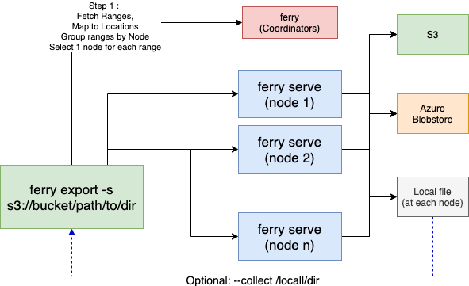

# ferry (Work in Progress)

## Goals

A set of utilities to manage and inspect a FoundationDB cluster.

There is experimental support for transparent export and import daata to `file://`, `s3://`, or `az://` urls. `az://` is a non-standard shorthand for azure blobstore urls.

### Installation

Clone the repo, and run

    go build

### List hosts in cluster

	$ ./ferry status --hosts
	10.23.216.13
	10.23.216.139
	10.23.216.140
	10.23.217.11

### Quick stats on the DB

	$ ./ferry stats -s 2>&1 | jq .
	{
	....
	"M": "Total",
	"size": 880916064143,
	"Smallest": {
		"Begin": "zFF",
		"End": "\\xff"
	},
	"Smallest partition": 27760000,
	"Biggest": {
		"Begin": "6c52c",
		"End": "6d184"
	},
	"Biggest partition": 208414113
	}

### Stats on each keyrange

	$ ./ferry stats 2>&1 | jq -c '{x:.Begin,y:.End,z:.Size}'  | head -n10
	{"x":"\\x15*\\x00\\x0297e94b9","y":"\\x15*\\x00\\x0297f0fd","z":71068750}
	{"x":"\\x15*\\x00\\x02a4eb4db","y":"\\x15*\\x00\\x02a4fb9c","z":151350750}
	{"x":"\\x15*\\x00\\x02c5612","y":"\\x15*\\x00\\x02c5702f","z":138096000}
	{"x":"\\x17\\x1b:\\xfd\\x02C\\x003\\x00\\x00\\x07m8\\xfd","y":"\\x17\\x1b:\\xfd\\x02C\\x003\\x00\\x00\\x07m9\\xb0","z":53669780}
	{"x":"f2402","y":"f2b14","z":122270666}
	{"x":"\\x15*\\x00\\x020dda66","y":"\\x15*\\x00\\x020de468a","z":94358750}
	{"x":"99fbe","y":"9abd6","z":205051641}
	{"x":"\\x15*\\x00\\x02b153bb","y":"\\x15*\\x00\\x02b15af","z":64938000}
	{"x":"\\x15*\\x00\\x02b6f3b37","y":"\\x15*\\x00\\x02b6fcf9","z":86584000}
	{"x":"\\x15*\\x00\\x02ab469f","y":"\\x15*\\x00\\x02ab5373","z":120731250}

### List prefixes by directory tree

	$ ./ferry tree 2>&1 | jq -c '{"x": .dir.FlattenedPath, "y": .dir.PrefixPrintable}' | head -n 10
	{"x":"uis_graph_graph_manager_benchmarks/1","y":"\\x17\\x1b>\\x10"}
	{"x":"uis_graph_graph_manager_benchmarks/2000/2009","y":"\\x17\\x1b*\\x83"}
	{"x":"uis_graph_graph_manager_benchmarks/2000/2010","y":"\\x17\\x1b@^"}
	{"x":"uis_graph_graph_manager_benchmarks/3004/3000","y":"\\x17\\x1b!\\x8a"}

### Export and import static data from Azure blobstore, S3, or local files.

    # Install TLS certificates and AWS/Azure credentails on all nodes
	# in standard places. See 
	# https://aws.amazon.com/blogs/security/a-new-and-standardized-way-to-manage-credentials-in-the-aws-sdks/

	ferry serve -v  # Run on each node

	ferry export -s /path/to/local/directory/

	ferry export -s s3://bucket/path/to/directory
	# credentials via `aws configure`

	ferry export -s az://container/path/to/directory
	# credentials via environment. See help from error message

### Usage

	$ ./ferry -h
	Set of utilities to manage data stored in FoundationDB

	Usage:
	ferry [flags]
	ferry [command]

	Available Commands:
	completion  Generate the autocompletion script for the specified shell
	export      Export all keys and values from FoundationDB
	help        Help about any command
	info        Print info on effective config
	serve       Serve exporter grpc server
	stats       Print stats about the current DB
	status      Print fdb status [ DO NOT USE: Incomplete ]
	tree        Print tree of directories

	Flags:
		--config string    config file (default is $HOME/.ferry.yaml)
	-h, --help             help for ferry
	-p, --port serve       Port to bind to (applies to serve and `export` commands
		--profile string   mem|cpu (Go performance profiling)
	-q, --quiet            Quiet (logs only WARN or above)
	-v, --verbose          Verbose logging

	Use "ferry [command] --help" for more information about a command.

### Usage (Server - Rquired on each fdb node)

After configuring the bind port (defaults to 8001) via `.ferry.yaml` in working-directory or home-directory, along with TLS settings, start a server on each node with

	ferry serve


### Usage (Client - a host with access to fdb.cluster file)

	ferry export -s s3://bucket/path/to/directory

	Usage:
	ferry export [flags]

	Flags:
		--collect string   Bring backup files to this host at this directory. Only applies to file:// targets
	-c, --compress         Compress export files (.lz4)
	-n, --dryrun           Dryrun connectivity check
	-h, --help             help for export
	-m, --sample           Sample - fetch only 1000 keys per range
	-t, --threads int      How many threads per range

	Global Flags:
		--config string      config file (default is $HOME/.ferry.yaml)
	-p, --port serve         Port to bind to (applies to serve and `export` commands
		--profile string     mem|cpu (Go performance profiling)
	-s, --store-url string   Source/target for export/import/manage (default "/tmp/")
	-v, --verbose            Verbose logging


## Export format

Export format, in oversimplied term is a length-prefixed binary dump of the form

```
[[ length ] [ key-bytes ] [ value-bytes ]] . . . .

length = 4 bytes in little-endian format.
Once read as an Unsigned Int 32, split them as follows

higher 14 bits is key length
lower 18 bits is value length
both considered enough for FDB limits

Psuedo code below
key-length = length >> 18 & ((1 << 14) - 1)
value-length = length & (1 << 18) - 1

```

We may look at flatbuffer for output format, but that depends on subsequent usage needs

# Distributed Setup (Optional)


